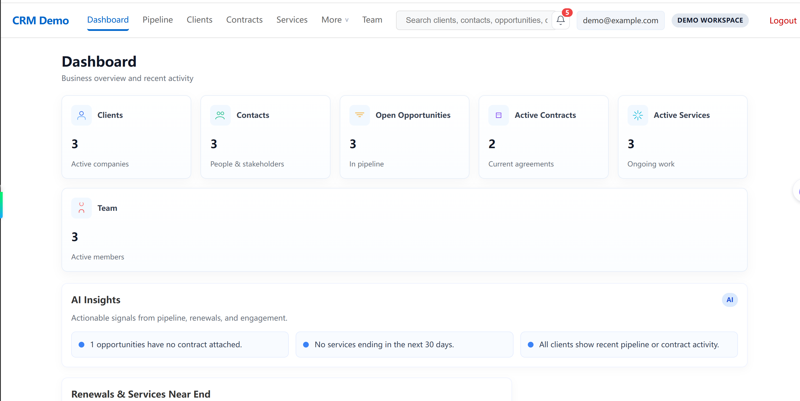
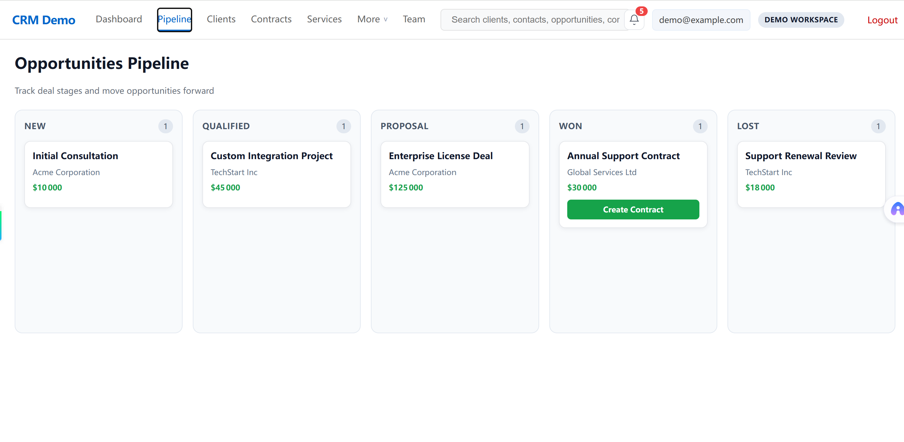
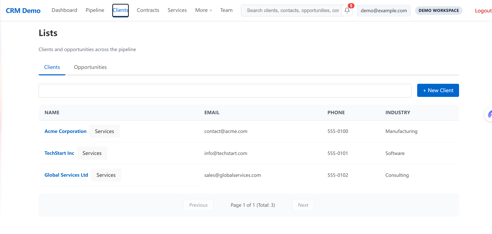
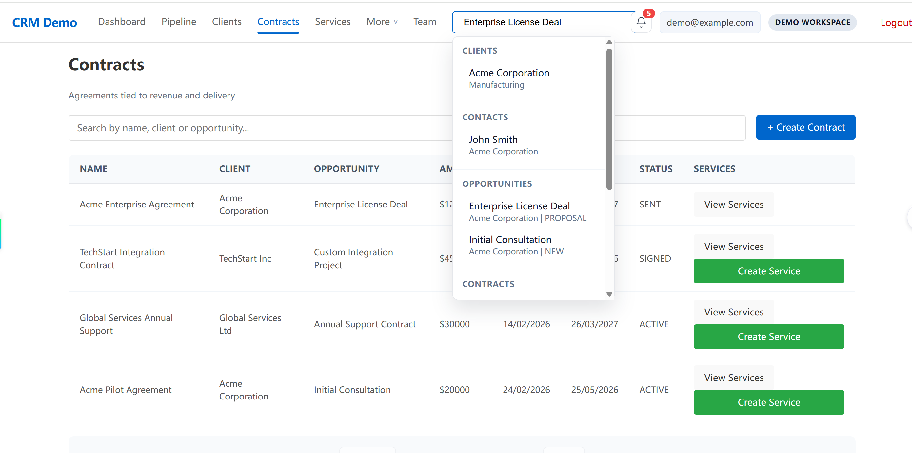
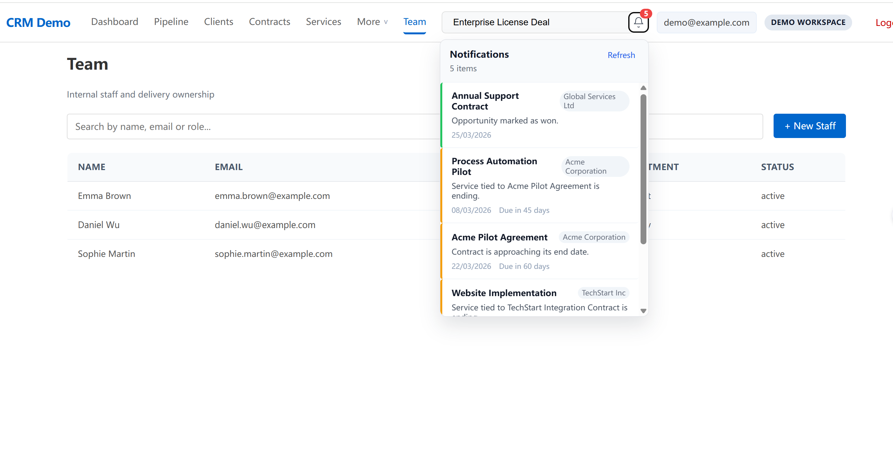

# CRM SaaS Showcase

A full-stack CRM showcase project designed to demonstrate not just feature delivery, but product thinking, workflow design, and end-to-end system structure.

This project models how a SaaS-style CRM supports the full business lifecycle: from client records and sales pipeline to contracts, services, notifications, and operational follow-up.

---

## Why this project matters

Many portfolio projects stop at isolated CRUD screens.  
This project was built differently: to reflect how a real CRM should support business operations across multiple connected workflows.

Instead of showing disconnected pages, it demonstrates:

- how data moves through a CRM system
- how product modules connect to each other
- how a full-stack application can be structured for usability, maintainability, and walkthrough stability

---

## What this project demonstrates

### Product thinking
- Designing realistic CRM workflows instead of simple form/list pages
- Structuring the lifecycle from **client → opportunity → contract → service**
- Creating interfaces that support both overview and operational follow-up
- Building a demo mode so the product can still be presented reliably without live infrastructure

### Full-stack engineering
- Frontend and backend separation with API-driven communication
- Relational data modeling for core business entities
- Modular backend structure with controllers, services, and Prisma repositories
- Search, notifications, and activity tracking as cross-cutting product features
- Demo-mode support for stable portfolio walkthroughs

### System design mindset
- Connecting business entities instead of treating them as isolated tables
- Supporting realistic user flows across dashboard, pipeline, client detail, and service delivery
- Preparing the project for presentation, testing, and maintainability

---

## Core business workflows

This CRM showcase focuses on the workflows below:

1. **Client Management**  
   Create and manage client organizations and related contacts.

2. **Sales Pipeline**  
   Track opportunities across stages and follow deal progression visually.

3. **Contracts Lifecycle**  
   Move from opportunity to contract with status visibility.

4. **Services Delivery Tracking**  
   Connect service records to client and contract context.

5. **Activity Timeline**  
   Record important business events and workflow actions.

6. **Global Search**  
   Search across multiple CRM entities from one entry point.

7. **Notifications**  
   Surface important business events such as wins, expirations, or service changes.

---

## Product modules

- Dashboard
- Clients
- Contacts
- Opportunities Pipeline
- Contracts
- Services
- Team
- Activity Timeline
- Global Search
- Notifications

---

## Tech stack

- **Frontend:** React, TypeScript, Vite
- **Backend:** Node.js, Express
- **ORM:** Prisma
- **Database:** PostgreSQL
- **API style:** REST

---

## Architecture overview

### Frontend
The frontend is designed as a SaaS-style web interface focused on operational clarity:
- dashboard-level visibility
- list/detail workflows
- search and notification access
- module-based navigation

### Backend
The backend follows a layered structure:
- route/controller layer for API endpoints
- service layer for business behavior
- Prisma-based data access and persistence

### Data model
The application models connected business entities such as:
- clients
- contacts
- opportunities
- contracts
- services
- activities
- notifications

This allows the CRM to reflect how operational data evolves over time, rather than storing unrelated records in isolation.

### Demo mode
A dedicated demo mode supports portfolio walkthroughs even without a live database connection.  
This makes the project easier to review in interview or showcase situations.

---

## Screenshots

### Dashboard

### Pipeline

### Client Detail

### Global Search

### Notifications

---

## Suggested walkthrough

For a quick product review, the recommended order is:

1. Open the Dashboard to review business overview and activity
2. Go to the Opportunities Pipeline to inspect deal flow
3. Open a Client Detail page to see connected records
4. Use Global Search to show cross-entity retrieval
5. Review Notifications and operational alerts
6. Check Contracts and Services modules for downstream workflow support

---

## What I wanted to show with this project

This project was built to demonstrate that I can work beyond isolated coding tasks.

It reflects my ability to:
- think in product workflows
- structure business features into a coherent system
- connect frontend behavior with backend and data design
- prepare a technical project for real presentation and review

---

## Repository note

This public repository is a **showcase version** prepared for portfolio and interview review.

The full source code is currently kept private.  
A private walkthrough can be provided during the interview process if needed.

---

## Contact

- LinkedIn: [Your link of LinkedIn]
- Email: [Your mail]